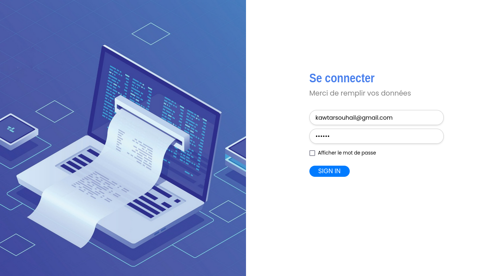
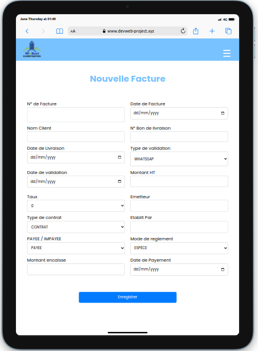
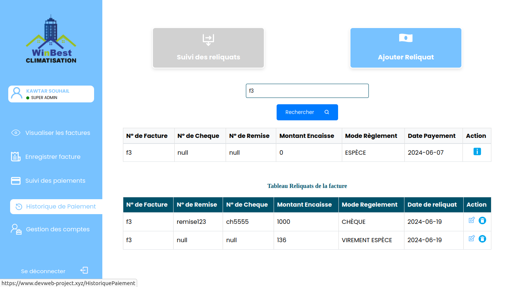
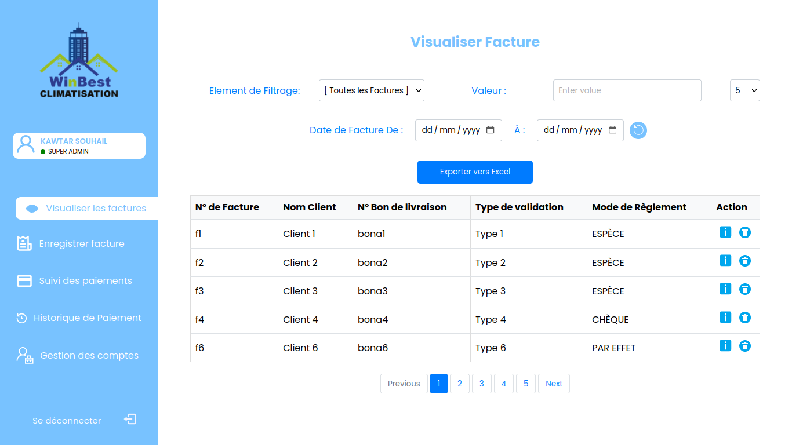

# 🧾 Invoice Management Web Application

Application Web de gestion des factures permettant le suivi, l’administration et le contrôle des factures d’une entreprise, avec un système d’authentification sécurisé et une gestion avancée des rôles utilisateurs.

Le projet est organisé en **monorepo**, avec un **backend Laravel** et un **frontend React**.

---

## 🚀 Fonctionnalités principales

### 🔐 Authentification
- Connexion via identifiants uniques
- Gestion sécurisée des sessions
- Contrôle d’accès basé sur les rôles

### 👥 Gestion des rôles
- **Utilisateur**
  - Consultation des factures et paiements
  - Filtrage des données
  - Export des données en format Excel
  - Suivi des reliquats (lecture seule)

- **Admin**
  - Toutes les permissions utilisateur
  - Création, modification et suppression des factures
  - Gestion des reliquats des factures

- **Super Admin**
  - Toutes les permissions Admin
  - Gestion des comptes utilisateurs
  - Ajout, suppression et modification des mots de passe

## 📸 Aperçu de l’application

### 🔐 Authentification


### 📱 Présentation de l’application sur mobile


### 📱 Présentation de l’application sur tablette (iPad)


### ⚙️ Actions principales de l’application


### 🧾 Gestion des factures


## 🏗️ Architecture du projet

```text
invoice-management-web-app/
│
├── backend/        # API REST - Laravel
│   ├── app/
│   ├── routes/
│   ├── database/
│   └── .env.example
│
├── frontend/       # Application Web - React
│   ├── src/
│   ├── public/
│   └── package.json
│
├── .gitignore
└── README.md
